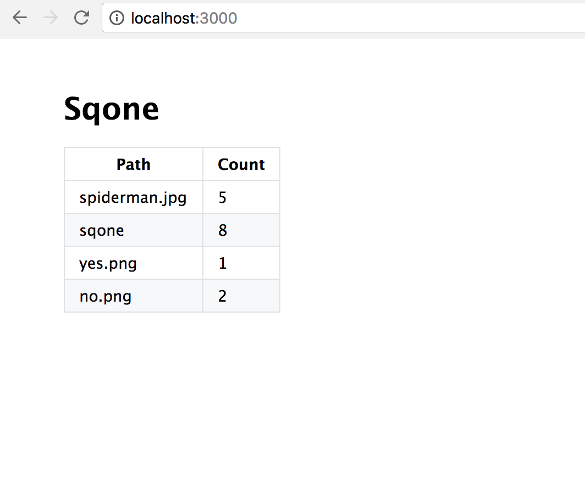

# sqone

Self hosted email tracker in Node.js



## How it works

Email tracking works by logging a GET request in an inline image on the email body.

With Sqone you can GET on any path (e.g. /sample-image.png) and get a
transparent 1x1 image back. This way you can attach an image when you don't
have an image you want attached.

On the index route you can see the number of requests on each path.

## Setup

```bash
npm install
npm start
npm run watch # for development
```

## Testing

```bash
npm test
```

## License

MIT
